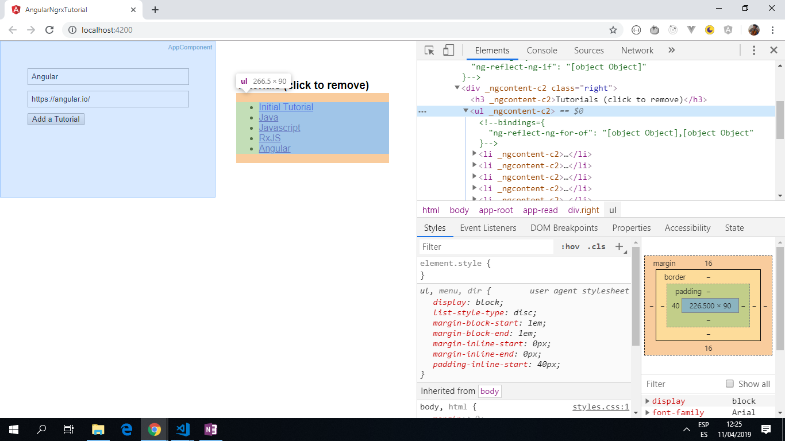

# :zap: Angular Ngrx Tutorial

* App that allows users to submit the name and url of a tutorial using a simple form and also to remove a tutorial, by using [ngrx/store](https://ngrx.io/), RxJS-powered state management.
* **Note:** to open web links in a new window use: _ctrl+click on link_


## :page_facing_up: Table of contents

* [:zap: Angular Ngrx Tutorial](#zap-angular-ngrx-tutorial)
  * [:page_facing_up: Table of contents](#page_facing_up-table-of-contents)
  * [:books: General info](#books-general-info)
  * [:camera: Screenshots](#camera-screenshots)
  * [:signal_strength: Technologies](#signal_strength-technologies)
  * [:floppy_disk: Setup](#floppy_disk-setup)
  * [:computer: Code Examples](#computer-code-examples)
  * [:cool: Features](#cool-features)
  * [:clipboard: Status & To-Do List](#clipboard-status--to-do-list)
  * [:clap: Inspiration](#clap-inspiration)
  * [:file_folder: License](#file_folder-license)
  * [:envelope: Contact](#envelope-contact)

## :books: General info

* This app uses Ngrx Store, a RxJS-powered state management solution, to organise the app`s state. NgRX was built for Angular. NgRX is overkill for such a simple app but this is for learning purposes only.

## :camera: Screenshots

.

## :signal_strength: Technologies

* [Angular v15](https://angular.io/)
* [RxJS Library v7](https://angular.io/guide/rx-library) used to handle datastreams and propagation of change using observables.
* [ngrx/store v15](https://ngrx.io/guide/store)

## :floppy_disk: Setup

* Run `ng serve` for a dev server.
* Navigate to `http://localhost:4200/`. The app will automatically reload if you change any of the source files.

## :computer: Code Examples

* _tutorial.reducer.ts_ file

```typescript
import { Action } from '@ngrx/store';
import { Tutorial } from './../models/tutorial.model';
import * as TutorialActions from './../actions/tutorial.actions';

const initialState: Tutorial = {
  name: 'Initial Tutorial',
  url: 'http://google.com'
};

export function reducer(state: Tutorial[] = [initialState], action: TutorialActions.Actions) {

  switch (action.type) {
    case TutorialActions.ADD_TUTORIAL:
      return [...state, action.payload]; // use spread operator to add action.payload to the array

    case TutorialActions.REMOVE_TUTORIAL:
      const currentState = [...state];
      currentState.splice(action.payload, 1); // use splice to remove selected item
      return currentState;

    default:
      return state;
  }
}
```

## :cool: Features

* Adds titles of courses and weblinks to a list array using NgRX for state management.

## :clipboard: Status & To-Do List

* Status: Working.
* To-Do: Nothing

## :clap: Inspiration

* [Article by Richard Oliver Bray](https://medium.com/@richbray): [A Beginner’s Guide to Ngrx/store](https://medium.com/stratajet-tech/a-beginners-guide-to-ngrx-store-bc2184d6d7f0).

## :file_folder: License

* This project is licensed under the terms of the MIT license.

## :envelope: Contact

* Repo created by [ABateman](https://github.com/AndrewJBateman), email: gomezbateman@yahoo.com
